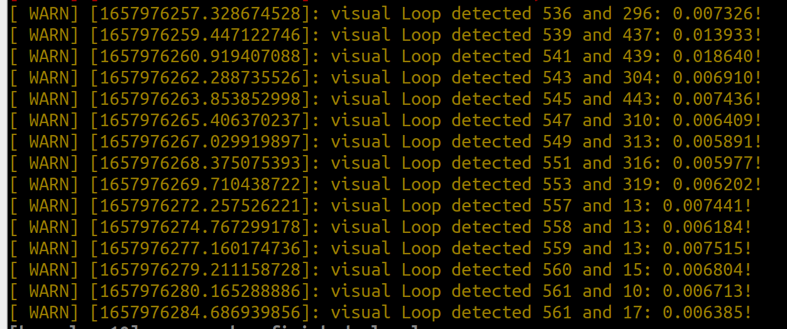
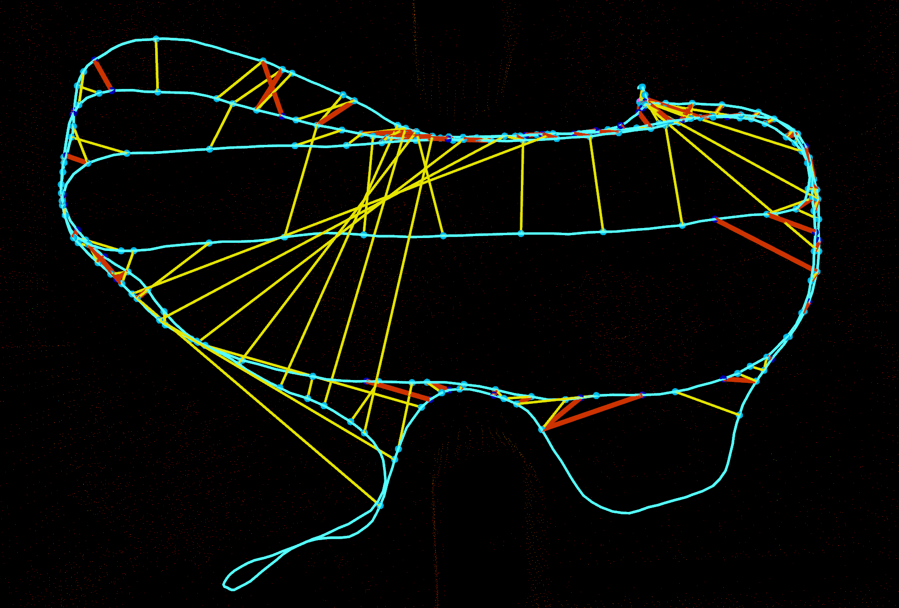
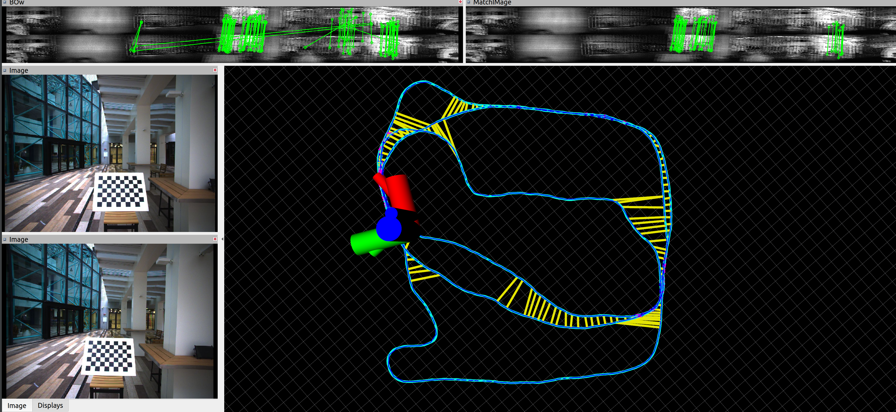
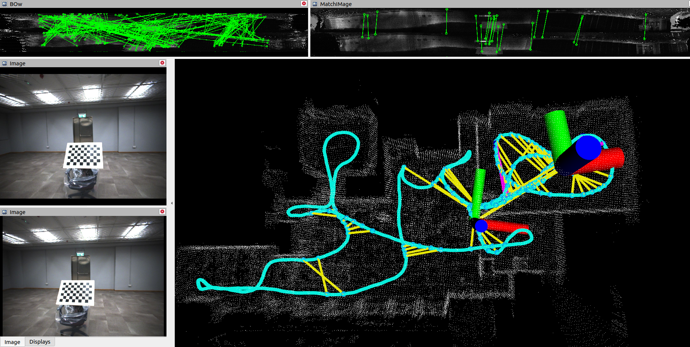
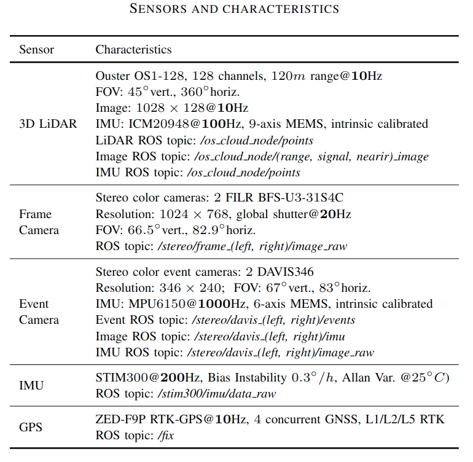

# LIO-SAM-6AXIS-INTENSITY
[LIO-SAM-6AXIS](https://github.com/JokerJohn/LIO_SAM_6AXIS) with intensity image-based  loop optimization. 

This repo integrates [LIO-SAM](https://github.com/TixiaoShan/LIO-SAM) and [Imaging_lidar_place_recognition](https://github.com/TixiaoShan/imaging_lidar_place_recognition) to achieve better mapping and localization result for SLAM system. Thanks for their hard work！

# Introdction

This repo may help to build more accurate point cloud maps by introducing the intensity-based visual loop constraint.

- contain all the functions of the [LIO-SAM-6AXIS](https://github.com/JokerJohn/LIO_SAM_6AXIS).
- support the intensity loop detection method with ICP refine to get the robust loop constriant and add them to the factor graph.

# Discussion

The system also has the following problems

- Effective for high-beam lidars, but poor for low-beam lidars such as VLP16

- Effective for indoor scenes, many closed-loop constraints found are better than the original ICP method, and the performance is poor in outdoor open scenes.

- It must be ensured that the number of point clouds is equal to the number of pixels of the intensity image.

- In the outdoor scene, the resolution of the intensity image is too low, so it is difficult to achieve the place recognition stably

We analyze why it is effective in indoor scenarios: 

1. There is no extrinsic error when the lidar is projected to the intensity image compared to RGB camera.
2. Each pixel of the intensity image corresponds to a unique lidar point. So there is an accurate depth, and the feature matching performance is good after the outlier rejection by PNPRansanc .

（red line segments are for visual loop constraint from intensity image）

# Dataset

**Fusion Portable(IROS 2022)**：

I will upload some test rosbag later!
